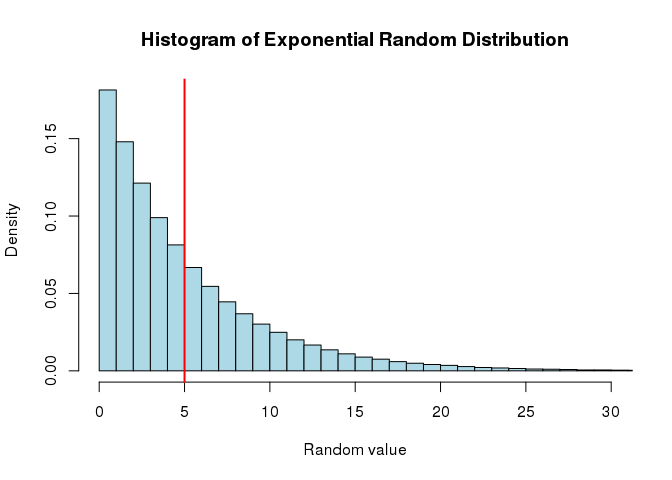
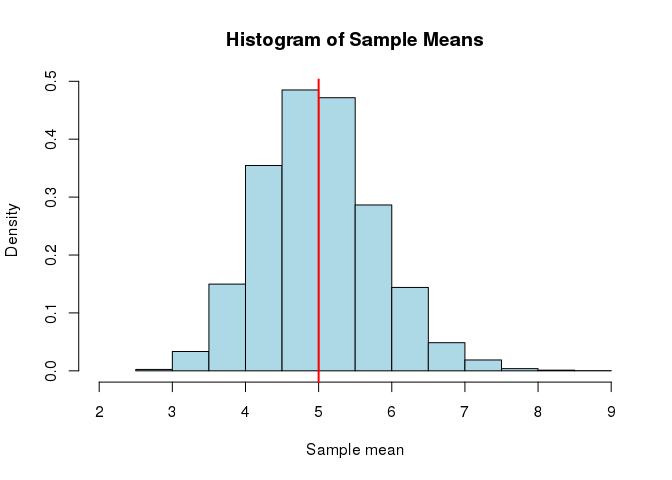
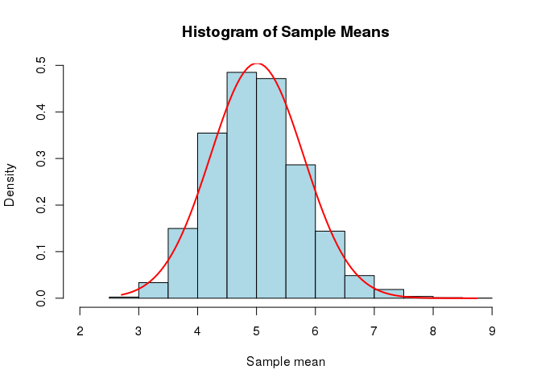
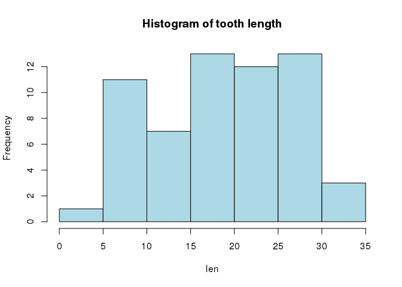
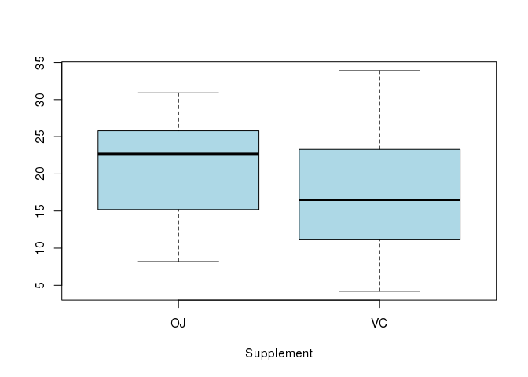
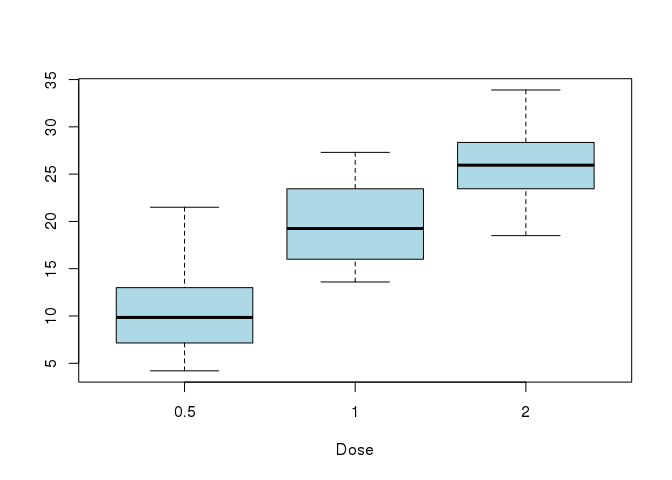

# Statistical Inference Course Project
Pawel Daniluk  
2016-11-28  


## Summary

This report is a final assignment of Statistical Inference Course Project. The report was written using `knitr`  package. The demonstrated plots were drawn using `base` plotting system for simplicity and reproducibility.. 

This report was written with [Vim](http://www.vim.org/), using [Nvim-R](http://www.vim.org/scripts/script.php?script_id=2628) plugin under Debian Linux. RMarkdown and Markdown files can be found in the [github](https://github.com/polde-live/statinf) repository.

The report is divided into two parts. First part covers the demonstration of simulation of exponentially distributed random variable, and then applying [Central Limit Theorem](https://en.wikipedia.org/wiki/Central_limit_theorem) to investigate the distribution of sample mean of the exponential distribution.

Second part of the report is dedicated t inferential analysis of `ToothGrowth` data set, which is included as a  standard `R` data set, available in any installation. The basic exploratory analysis of the data set is performed, followed by the inference analysis of differences between mean teeth growth over different groups in data set. 

It was demonstrated, that some observable differences in sample mean may not be statistically significant under given conditions.

## Part 1: Exponential Distribution Simulation

First part of the project focuses on the simulation of large set of random data. After random data is generated, the theoretical and empirical distribution are compared. Finally, the random data is grouped into series of random samples. The distribution of random sample mean is them examined if it adheres to Central Limit Theorem assumptions.

### Generating random data

The Exponential distribution is described with a parameter $\lambda$. 
In the course project, $\lambda$ parameter is set to be 0.2.
The theoretical mean and standard deviation are equal and given as follows:

$\mu=\frac{1}{\lambda}=5$


$\sigma=\frac{1}{\lambda}=5$

First exponential random variable simulation is to generate large volume of random data. 
First, the random seed will be set, to ensure reproducible results. The random data is grouped in samples, 40 observation per sample.
The Exponential distribution is probability distribution that describes the time between events in a Poisson process, as described in [Wikipedia](https://en.wikipedia.org/wiki/Exponential_distribution).


```r
# set random seed
set.seed(123456)

# total number of random samples
nsim <- 10000

# number of random observation per sample
obs <- 40

# lambda parameter for distribution
lbd = 0.2

# simulate random numbers
x <- matrix(rexp(nsim*obs, lbd), ncol=obs)
```

The random values were saved in matrix. 
For the purpose of the exercise, 10000 random samples were generated, each containing 40 observations. 
Total number of generated random numbers is 400000. The generated random numbers were saved as matrix, in order to facilitate calculation of sample means. 

The following histogram displays the empirical distribution of randomly generated exponentials. The break widths are set to be equal to 1. The red vertical line indicates the distribution mean. It can be noted, that the exponential distribution is not symmetrical, therefore, values are not obviously centered around mean value.


```r
# Plot histogram of Exponentials with vertical line at mean
hist(x, col="lightblue", freq=F, main="Histogram of Exponential Random Distribution"
    , xlab="Random value"
    , xlim=range(0:30)
    , breaks=60)
abline(v=5, lw=2, col="red")
```

<!-- -->

Further investigation of empirical statistics indicates, that both empirical mean(m) and standard deviation(s) are close to theoretical values of $\mu$ and $\sigma$ of the Exponential Distribution.
The sample statistics are calculated as follows:

$m=5.0086674$

$s=5.0027976$


### Sample mean distribution 

In order to investigate the distribution of sample mean distribution, each for each random sample, empirical mean was calculated. The resulting data was a vector of 10000 elements.

Using `apply` function allows to calculate required statistics over matrix dimensions. In this case, the **mean** function is calculated over matrix **x** rows, i.e. mean is calculated for each of random samples.

The following histogram illustrates the distribution of random sample means. 


```r
# Calculate the samples means
sm <- apply(x, 1, mean)
hist(sm, col="lightblue", freq=F, main="Histogram of Sample Means"
     , breaks=9
     , xlim=range(2:9)
     , xlab="Sample mean")
abline(v=5, lw=2, col="red")
```

<!-- -->

According to Central Limit Theorem, the distribution of mean of random samples, follow Normal distribution with mean $\mu_s=\mu$ and standard deviation $\sigma_s = \frac{\sigma}{\sqrt(n)}$.

Since 40 random variables were generated in each sample.Let $_s$ denote sample mean parameters. Ujjjr this assumptions we expect the sample mean and standard deviation to be as follows:


$\mu_s = 1/\lambda = 5$

$\sigma_s = \frac{1}{\lambda \times \sqrt(n)} = \frac{1}{0.2 \times \sqrt(40)} \approx 0.7906$

Indeed, the calculated results are confirming the expectations. Empirical mean and standard deviation are as follows:

$m_s =5.0086674$

$s_s = 0.7902007$

The theoretical and empirical results are closely matched. Finally, Normal distribution density plot is  overlayer over histogram of sample means. As expected, histogram and density plot are matching are close to each other. This confirms out expectations under CLT.


```r
# Draw histogram
hist(sm, col="lightblue", freq=F, main="Histogram of Sample Means"
     , breaks=9
     , xlim=range(2:9)  
     , xlab="Sample mean")

# Overlay normal density plot N(m,s)
xfit <- seq(min(sm), max(sm), length=100)
yfit <- dnorm(xfit, mean=mean(sm), sd=sd(sm))
lines(xfit, yfit, col="red", lwd=2)
```

<!-- -->

## Part 2: Inferential Data Analysis

The second part of the report covers inferential analysis of `ToothGrowth` dataset. First, basic exploratory data analysis will be performed. Then, tooth growth will be compared by **supp** and **dose** attributes, using t-test techniques.  

### Date description

The `ToothGrowthi` dataset describes the Effect of Vitamin C on Tooth Growth in Guinea Pigs. The [detailed description](https://stat.ethz.ch/R-manual/R-devel/library/datasets/html/ToothGrowth.html) can be found in the `R` documentation.

The data set contains 60 observations and three variables:

1. **len**  Tooth length 
2. **supp** Supplement type (Ascorbic Acid or Orange Juice)
3. **dose** Dose in mg/day 

### Exploratory analysis

As first stage of exploratory analysis, the **len** variable will be described. Statistics will be calculated for whole sample and in groups.


```r
# Short names for variables
len <- ToothGrowth$len
sup <- ToothGrowth$supp
dose <- ToothGrowth$dose
```

First, the histogram of analysis variable is plotted.  The data follows no apparent probability distribution, which can be explained by relatively sample size.

```r
hist(len, col="lightblue", main="Histogram of tooth length")
```

<!-- -->
The mean and basic moments can be displayed with `summary` function. The box-whiskers plot is used to visualise moments of the sample. 

```r
summary(len)
```

```
##    Min. 1st Qu.  Median    Mean 3rd Qu.    Max. 
##    4.20   13.08   19.25   18.81   25.28   33.90
```
Similar tool set can be used to analyze the `len` variable in groups. First, the `sup` groups are compared.
In order to calculate summary statistics in each groups, `tapply` function can by used.

It appears, that there is a difference in medians and means between both groups. 


```r
tapply(len, sup, summary)
```

```
## $OJ
##    Min. 1st Qu.  Median    Mean 3rd Qu.    Max. 
##    8.20   15.52   22.70   20.66   25.72   30.90 
## 
## $VC
##    Min. 1st Qu.  Median    Mean 3rd Qu.    Max. 
##    4.20   11.20   16.50   16.96   23.10   33.90
```

```r
boxplot(len~sup, col="lightblue", xlab="Supplement")
```

<!-- -->

Similarly, `dose` variable can be used for grouping the data. It appears, that as in case of `sup` groups, the there are differences in mean and median. 


```r
tapply(len, dose, summary)
```

```
## $`0.5`
##    Min. 1st Qu.  Median    Mean 3rd Qu.    Max. 
##   4.200   7.225   9.850  10.600  12.250  21.500 
## 
## $`1`
##    Min. 1st Qu.  Median    Mean 3rd Qu.    Max. 
##   13.60   16.25   19.25   19.74   23.38   27.30 
## 
## $`2`
##    Min. 1st Qu.  Median    Mean 3rd Qu.    Max. 
##   18.50   23.52   25.95   26.10   27.83   33.90
```

```r
boxplot(len~dose, col="lightblue", xlab="Dose")
```

<!-- -->

Although differences of means betweens groups can be observed in sample, statistical significance of the differences needs to be verified in a formal manner. Since the sample size is small, the t-test seems to be appropriate tool.

### Interference analysis

First, means in two supplement groups will be compared, using two sided t-test. Since the observations are not paired, sample need to be divided into groups for each levels of `sup` variable. First, the test hypotheses needs to be formulated.

$H_0: \mu_a = \mu_b$

$H_1: \mu_a \neq \mu_b$


```r
soj <- len[sup=="OJ"]
svc <- len[sup=="VC"]
tsup <- t.test(soj, svc, alternative="two.sided")
print(tsup)
```

```
## 
## 	Welch Two Sample t-test
## 
## data:  soj and svc
## t = 1.9153, df = 55.309, p-value = 0.06063
## alternative hypothesis: true difference in means is not equal to 0
## 95 percent confidence interval:
##  -0.1710156  7.5710156
## sample estimates:
## mean of x mean of y 
##  20.66333  16.96333
```

The calculated t-statistic for this test is 1.9152683, with p-value 0.0606345. Since calculated p-value is greater than confidence level of 5%, there are no statistical conditions to reject Null hypothesis. The calculated p-value is however close to critical level of 5%, which in suggests, that repeating the test or collecting additional observation might bear more definitive results.

As a final step of the analysis, to investigate the statistical significance of difference of means in dose groups. Similarly as before, sample is divided into groups. Each group is then compared with other, in order to draw concussions.  


```r
d05 <- len[dose==0.5]
d1 <- len[dose==1]
d2 <- len[dose==2]
```

For each test, two sided hypotheses are formulated:

$H_0: \mu_a = \mu_b$

$H_1: \mu_a \neq \mu_b$


```r
t1 <- t.test(d05, d1, alternative="two.sided")
print(t1)
```

```
## 
## 	Welch Two Sample t-test
## 
## data:  d05 and d1
## t = -6.4766, df = 37.986, p-value = 0.0000001268
## alternative hypothesis: true difference in means is not equal to 0
## 95 percent confidence interval:
##  -11.983781  -6.276219
## sample estimates:
## mean of x mean of y 
##    10.605    19.735
```

The comparison of two groups with dosage of 0.5 and 1 mg/day yields t-statistic of -6.4766477, with p-value of 0.0000001. This result lead to rejecting Null hypothesis in favour of alternative - therefore the difference of means if those two groups is statistically significant. 


```r
t2 <- t.test(d05, d2, alternative="two.sided")
print(t2)
```

```
## 
## 	Welch Two Sample t-test
## 
## data:  d05 and d2
## t = -11.799, df = 36.883, p-value = 0.00000000000004398
## alternative hypothesis: true difference in means is not equal to 0
## 95 percent confidence interval:
##  -18.15617 -12.83383
## sample estimates:
## mean of x mean of y 
##    10.605    26.100
```

The comparison of two groups with dosage of 0.5 and 2 mg/day yields t-statistic of -11.799046, with p-value of 0. This result lead to rejecting Null hypothesis in favour of alternative - therefore the difference of means if those two groups is statistically significant. 


```r
t3 <- t.test(d1, d2, alternative="two.sided")
print(t3)
```

```
## 
## 	Welch Two Sample t-test
## 
## data:  d1 and d2
## t = -4.9005, df = 37.101, p-value = 0.00001906
## alternative hypothesis: true difference in means is not equal to 0
## 95 percent confidence interval:
##  -8.996481 -3.733519
## sample estimates:
## mean of x mean of y 
##    19.735    26.100
```

The comparison of two groups with dosage of 1 and 2 mg/day yields t-statistic of -4.9004843, with p-value of 0.0000191. This result lead to rejecting Null hypothesis in favour of alternative - therefore the difference of means if those two groups is statistically significant. 

The final conclusion from the inference analysis is that the effect of supplement type on the teeth growth is statistically insignificant, while the observed data suggest that difference in dosage of supplement has a statistically significant effect.
